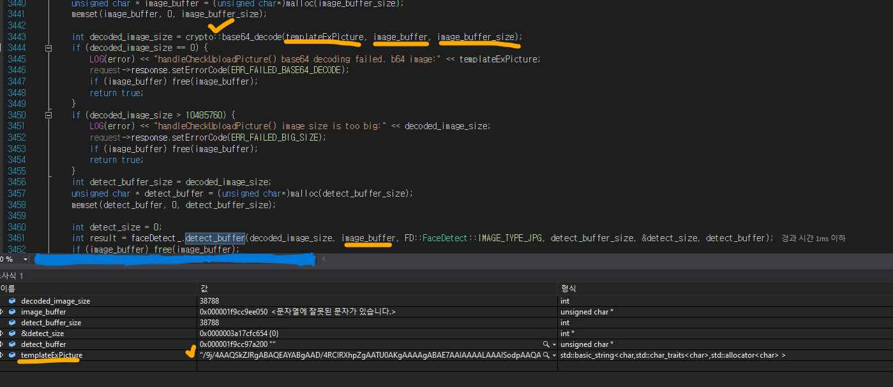
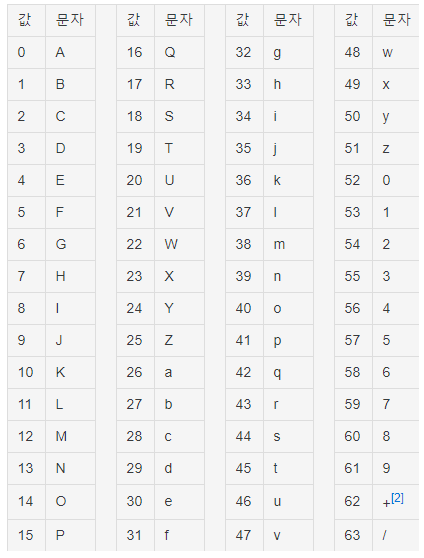
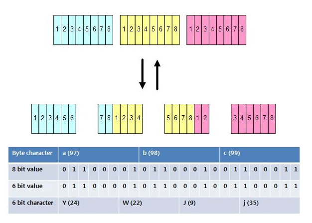
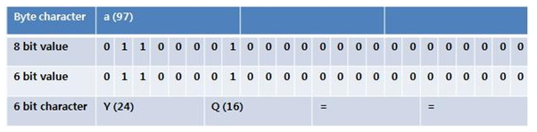

## Base64에 대해 

: Base64 encoding/decoding을 개발하면서 많이 사용한다. 8bit data에서는 text 문자가 아닌 다른 기호나 글자들이 들어갈 수 있기 때문에, 모든 것들을 텍스트로 바꿔주기 위한 방법이다.   
만약 사용자가 암호화하는 자바코드를 만들어서 String를 암호화 시킬때, 관리를 위해 암호화된 String를 서버에 전달해야하는데, 암호화된 String에는 %,#등의 특수문자들이 생기기 때문에 서로 연동이 안되는 부분이 생긴다. 즉, 해석을 할 수 없다는 것이다.
따라서 %,#,! 등의 기호를 텍스트로 바꿔 전달하고, 서버에서는 전달받은 암호화된 String을 원래대로 복구 시켜 순수 암호화 String를 저장하고 관리하게 된다. 

나의 경우 img를 api로 전달받으면서 base64로 encoding된 상태이며, 해당 img_base64_encoded 값을 다시 base64_decoding 시켜, 원본 img_buffer와 img_buffer_size를 
FaceDetect 함수에 전달하면, 해당 FaceDetect에서 넘겨받은 imgBuffer/size를 openCV로 읽어 드리고, 디텍트를 진행한다. 
이 과정에서 base64 인코딩된 상태, 그리고 웹API를 통해 img등 데이터를 넘겨 받을때, 이미지가 base64로 인코딩 되서 넘긴다는 것 등의 이해가 필요하다. 
다시 디코딩해서 openCV에서 imread(imgpath) 말고, imread_buffer(imgBuffer)로 읽는 형태로 구현이 필요한 것이다.  

 
따라서 관련 개념을 정확히 이해하고 사용하고자 정리를 시작한다.  

## 인코딩이란?
: 정보(데이터)의 형식,형태를 표준화, 보안, 처리 속도 향상, 저장 공간 절약 등을 위해 다른 형식,형태로 변환하는 것을 의미한다.  
## 디코딩이란?
: 인코딩의 반대 작업으로 복호화라고도 하며, 부호화된 정보를 부호화 되기 전으로 되돌리는 처리방식들을 통칭한다.  

##Base64 Encoding?
Base64란 Binary Data를 Text로 바꾸는 Encoding의 하나로써 Binary Data를 Character set에 영향을 받지 않는  
공통 ASCII 영역의 문자로 이뤄진 형태로 바꾸는 Encoding이다.  

Base64는 말 그대로 64진법이다. 64진법은 컴퓨터에게 있어 2^6=64(2진법 제곱수)이며 화면에 표시되는 ASCII 문자들로  
표시 할 수 있는 가장 큰 진법이기 때문이다. (ASCII에는 제어문자가 다수 포함되어 있어 화면에 표시되는 문자가 128개가 되지 않는다.)  

Binary Data --> Text로 변경하는 encoding이다.  
Binary Data를 6bit씩 짜른 뒤, 6bit에 해당하는 문자를 아래 Base64 색인표에서 찾아 치환한다. (패딩도 진행 '=')  
24bit의 buffer를 생성하여, 위쪽(MSB)부터 byte data를 넣은 뒤, 버퍼의 위쪽부터 6bit 단위로 짤라 Base64 테이블의 ASCII 문자로 변환한다. 
(origin Str -> ASCII binary -> 6bit cut -> base64 encoding) 

  

##'abc' 문자열이 base64 encoding 되기까지
1. a,b,c는 각각 8bit씩 24bit로 구성, 6bit로 나눈다. 

2. 나눈 문자열을 base64 색인표에 해당하는 값으로 치환하면 YWJj가 된다. 
3. base64로 인코딩을 할 경우 끝에 =이 많이 붙어 나오는 이유는 다음과 같다. 
   일반적으로 문자는 1byte(8bit)로 되어 있고, base64는 6bit로 되어 있다. 
   인코딩하고 나누는 과정에서 혼란이 발생하지 않도록 6,8의 최소 공배수인 24bit씩 묶어서 처리한다. 
   따라서 아래와 같이 a를 입력할 경우 24bit에 다 채우지 못하기 때문에 6bit씩 짜르면 YQ가 생성되고 
   나머지 16bit를 활용하기 위해 끝에 '='를 채워 base64로 인코딩한 스트링이 생성된다. 
   

 