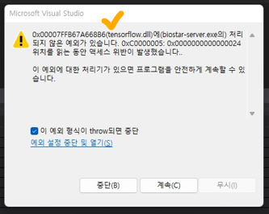

## 0xC0000005:0x0000000 예외처리에러: 원인/해결법

: 개발을 진행하다가 겪은 하나의 이슈를 정리한다. 
컴파일 에러는 아니고, 해당 함수를 호출 하는데, 아래와 같이 0x00000위치를 읽는 동안 액세스 위반이 발생했습니다. 에러 팝업이 뜬다.  
원인과 해결법에 대해 알아보고, 앞으로는 해당 이슈가 나지 않게 하고! 나더라도 쉽게 패스해보자!  

### 원인
액세스 위반 -> 프로세스가 접근 권한이 없는 메모리 영역에 접근을 시도하면 발생
메모리 할당이 되지 않은 포인터(NULL)에 값을 넣거나, 할당된 메모리를 초과할때 발생
동적 메모리를 할당하지 않았을때 발생

    int* tmp;
    tmp[0] = 10;        // error (할당되지 않음)

    int* tmp1;
    tmp1 = new int[10];
    tmp1[15] = 10       // error (할당되었으나, 할당 메모리를 넘어서 사용)

### 해결법
1. 변수를 초기화 해주거나, 할당을 제대로 해주는 것이 필요하다.
2. 할당된 변수의 메모리 크기보다 크면 안된다.
3. 외부 라이브러리를 불러다 쓰는 경우, 초기화 해주는 함수 initialize() 들이 있는지 확인 한다.

  