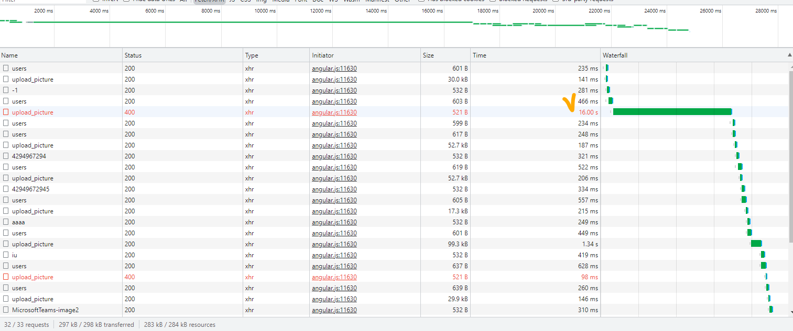

## API 콜 Image Upload, chrome padning에 대해(문제는 c++ boost; read_json 함수) 

: 개발을 진행하다가 겪은 하나의 이슈를 정리한다. +Debuging 흐름(하는법) 공유  
출입 장치에 사용자 얼굴 이미지를 등록하려다 보면 일괄로 폴더에 있는 사진들을 등록할 필요가 있다.  
아래와 같은 수 많은 친구들.. 

 
간단히 요약하면 폴더 이미지들을 기반으로 사용자 생성 및 출입 얼굴로 import 등록하는 기능이다.   
출입 장치에서 사용자의 얼굴을 감지하다보니, 보통 사이즈는 결국 규격화 되지만,  
crop, resize하기 전의 이미지는 1MB미만~10MB초과 등 다양하다.   
Request, Response 느낌을 느껴보자.

    웹에서 등록할 이미지 폴더 선택
    -> javaScript API콜 -> Java Spring(chainFilter) -> Thirft C -> C Server Logic -> Device Transfer
    -> 해당 사용자 출입 가능

### 왜 이렇게 오래걸려? pandding?
#### (결론) c++ boost! read_json() 때문!   + Debug Mode에서 Break Point를 잡을 때, 간혹 다음 Point로 넘어갈때 오래걸리기도 하니 제거하고도 돌려보자.. 꼭!
아래 사진이 보이는가? 다른 upload_picture 들은 ~100-500ms인데, 자기 혼자 15-20s~를 잡아 먹고 있다.  
처음에는 해당 사진 용량을 다른 사진들과 비교해보니, 보통 1MB 미만인데, 해당 사진은 7MB 이였다.   

들었던 생각.

    1. 해당 API콜을 하면서 BASE64 Encode Buffer를 풀어해치고 다시 파싱하거나, 대입하는게 있나?
    2. 그래도 이건 너무 오래 걸리는 작업인데? 뭔가 소스상에서 잘못 처리하는가보다. 가즈아 디버깅.
    3. 여기 서버는 Client -> Java Spring -> thrift -> C -> Device(Edge)로 구성고 디버깅 해보니 client에서 팬딩 요소 없음.. clear
    4. 그 다음 Java Spring을 봤더니 어라 filterChain를 걸면서 마지막 SecurityFilter에서 3초이상 머무네? 이놈이구나!
       필터 관련 @overwrite 받아서 특정 api콜을 except하는 것들 permissionAll()이 있길래 그렇게 구현.. clear
    5. 해당 api콜이 filterChain에 포함되지 않아도.. 똑같이 느림.. What the.. hell?
       그 다음 스탭인 thrift 쪽을 살펴보니 전송 속도 때문인가..? 그래도 아니야 이것도.
    6. C로 왔을때 세세하게 디버깅 안했다. 그냥 여기서도 한 6초 잡아 먹더라.
       처음에는 FaceDetect.lib에서 처리하느라 2-3초 감안하고 그 외에 문제가 뭐지?
    7. 열심히 찾다보니... 범인은 C에서 발견 위의 4~5번에 해당하는 것들은 순전 debug 모드 + breaking point 때문에 Delay 발생..
    8. 바로 read_json().. boost에서 제공하는 함수인데, 여기서 json으로 바꾸는 과정에서 img buffer의 경우 상당히 length가 크기 때문에.. 
       오래걸린다. 작은 사이즈의 이미지들은 length가 작아서 문제가 되지 않는데 말이다.

즉, C++의 성능을 기하급수적으로 커버해주는 Libraries인 Boost가 잘못했다.  
그림 이미지를 json으로 읽고 해당 Buffer를 저장하는 컨셉상 어쩔 수 없이 사용하지만,   
read_json()를 할 때, 이미지버퍼와 같은 긴 랭스는 피해 구조를 짜는게 좋을 것 같다는 생각이 든다.  

나는 Json Format과 친하니까.. data parsing도 많이 하고.. json format으로 많이 구현해서 보관하기도 하는데..  
특히 contents들을 key-val형태로 보관하고 이를 활용 하는데, C++를 써야하는 상황이라면 조금 다르게 접근해서 풀어야 할 것 같다!  

  