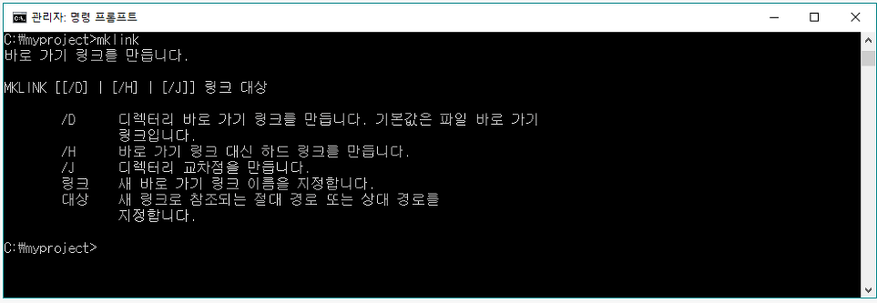

## mklink 대해 

: NTFS 파일시스템(복구 가능한 파일 시스템) 기반에서 특정 파일, 폴더에 대해 링크를 걸어주는 것을 의미한다.

    mklink /d "링크할곳" "실재위치"

 
개발을 하다보면, 빌드 소스쪽이랑, 개발 소스쪽이랑 바라보는 곳이 다를 수가 있다.
가령 client 작업 global language, text format 등등..

나의 경우도, "C:\source\project\installer\resources"에 빌드 결과물이 생성되고 있다면,
실제 개발 client 소스는 "C:\source\web-client\app\resources"에 반영된 결과물을 웹에 랜더링한다.

위의 경우에는 빌드가 될때마다, 빌드결과물(installer\resources폴더)을 웹에 보여주는 폴더로(app\resources) 하드카피 해야한다.  
이러한 경우 mklink를 활용하면, 빌드 될때마다 하드카피 필요 없이, 바로 웹에 랜더링된 결과를 새로고침(F5)을 통해 확인 가능하다.

## mklink 과정

1. cmd창에서 mklink를 입력하면 관련 커맨드가 나타난다.

2. 파일에 대한 link 설정 (현재 위치에 notepad 파일을 링크)

3. 폴더 경로에 대한 link 설정 (현재 위치에 windows 폴더를 링크)

4. 결과 확인

 
 