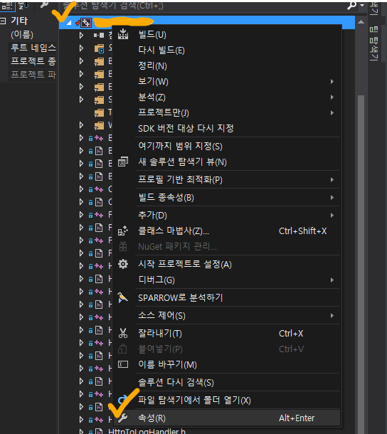
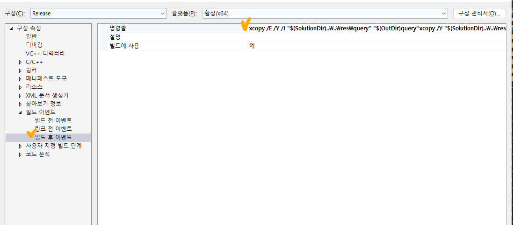
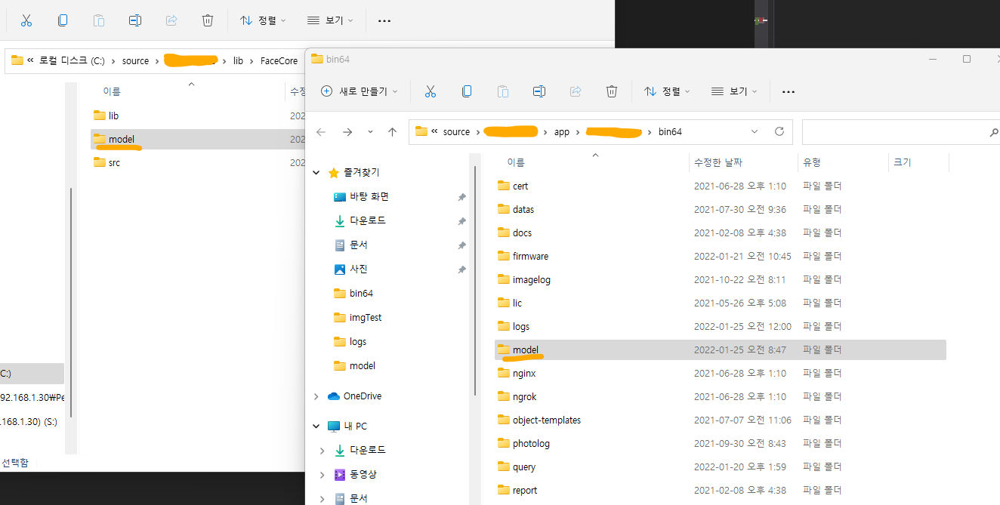

## XCOPY 대해 (fit.visual studio 빌드 후 이벤트 활용 하기) 

: XCOPY는 여러 파일, 전체 디렉토리 트리를 기반으로 하나의 디렉토리에서 다른 디렉토리로 파일을 복사할 때 사용한다.  
즉, 스크립트를 이용하여 파일 복사하는 기능이다. 윈도우나 다른 os에서 GUI를 지원하는 경우 Ctrl+C, Ctrl+V로 복사가 용이하다.  
대량의 파일을 복사하거나, 덮어써야할 파일 구분이 필요한 경우 XCOPY 명령어를 활용하면 좋다.

    xcopy /추가명령어 "원본 주소" "복사할 주소"
    xcopy /S /Y /E /I "C:\source\model" "C:\result\build\msvc\..\..\bin64\model"

개발 릴리즈를 하다보면, 빌드 후 결과물에 .dll, folder 등 파일을 바라보게 해야한다.  
이 경우 git이나 server쪽에서 관리하는 파일 디렉토리와 실제 소스코드상에서 ../ 상대경로로 바라보는 곳과 차이가 생기게 된다.  
따라서 그런 경우에 아래와 같이 Visual Studio 솔루션 탐색기 - 속성 - 구성속성 - 빌드 이벤트 - 빌드 후 이벤트에서 xcopy 명령어를 활용하면  
빌드가 끝나고 원하는 경로에 파일을 복사 할 수 있다.   
주로 개발 할 때 사용한 .dll, folder등을 빌드 경로에 추가로 넣어 활용 할 수 있다.  

    xcopy /?     <추가명령어 설명>
    /A           보관 특성을 가진 파일만 복사하며 보관 특성을 수정하지 않습니다.
    /M           보관 특성을 가진 원본 파일만 복사하며 보관 특성을 지웁니다.
    /D:m-d-y     지정된 날짜 이후에 바뀐 파일을 복사합니다. 날짜가 지정되지 않으면 대상 파일보다 새로운 원본 파일만 복사합니다.
    /EXCLUDE:파일1[+파일2][+파일3]... 문자열을 포함하는 파일 목록을 지정합니다. 각 문자열은 파일의 다른 행에 있어야 합니다. 일부 문자열이 복사할 파일의 절대 경로의 일부분과 일치하면 복사할 파일에서 제외됩니다.
             예를 들어 \obj\ 또는 .obj와 같은 문자열을 지정하면 obj 디렉터리 내의 모든 파일을 제외하거나 .obj 확장자를 갖는 모든 파일을 제외합니다.
    /P           각 대상 파일을 만들기 전에 물어봅니다.
    /S           비어 있지 않은 디렉터리와 하위 디렉터리를 복사합니다.
    /E           비어 있는 경우를 포함하여 디렉터리와 하위 디렉터리를 복사합니다. /S /E 스위치와 같으며 /T를 수정하는 데 사용될 수 있습니다.
    /V           새 파일의 크기를 검증합니다.
    /W           복사하기 전에 아무 키나 누릅니다.
    /C           오류가 생겨도 복사를 계속합니다.
    /I           대상을 찾을 수 없고 두 파일 이상을 복사하면 대상을 디렉터리로 지정합니다.
    /-I          대상을 찾을 수 없고 하나의 지정된 파일을 복사하면 대상이 파일이라고 가정합니다.
    /Q           복사하는 동안 파일 이름을 표시하지 않습니다.
    /F           복사하는 동안 원본과 대상 파일의 전체 경로를 표시합니다.
    /L           복사할 파일을 표시합니다.
    /G           암호화를 지원하지 않은 대상에 암호화된 파일의 복사를 허용합니다.
    /H           숨겨진 파일과 시스템 파일도 복사합니다.
    /R           읽기 전용 파일을 겹쳐 씁니다.
    /T           파일은 복사하지 않고 디렉터리 구조만 생성합니다. 빈 디렉터리 또는 하위 디렉터리는 포함하지 않습니다. /T /E 빈 디렉터리와 하위 디렉터리를 포함합니다.
    /U           대상에 이미 있는 파일을 복사합니다.
    /K           특성을 복사합니다. 일반적인 Xcopy는 읽기 전용 특성을 다시 설정합니다.
    /N           만들어진 짧은 파일 이름을 사용하여 복사합니다.
    /O           파일 소유권과 ACL 정보를 복사합니다.
    /X           파일 감사 설정을 복사합니다(/O 포함).
    /Y           기존 대상 파일을 덮어쓸지 여부를 묻지 않습니다.
    /-Y          기존 대상 파일을 덮어쓸지 여부를 묻습니다.
    /Z           다시 시작할 수 있는 모드에서 네트워크 파일을 복사합니다.
    /B           기호 링크와 링크 대상을 복사합니다.
    /J           버퍼를 사용하지 않은 I/O를 사용하여 복사합니다. 매우 큰 파일에 권장합니다.
    /COMPRESS    해당되는 경우 파일 전송 중 네트워크 압축 요청
    /SPARSE      스파스 파일을 복사할 때 스파스 상태를 유지합니다.
    /Y 스위치가 COPYCMD 환경 변수에 사전 설정되었을 수 있습니다.
 

## visual studio 빌드 후 이벤트 활용하기 (xcopy)

1. 현재 프로젝트 솔루션 - 솔루션 우측 클릭 - 속성

2. 구성속성 - 빌드 이벤트 - 빌드 후 이벤트 - 명령줄 - 편집

3. visual studio 빌드 - 빌드가 끝나고 원하는 폴더에 폴더 및 파일들 복사 완료

